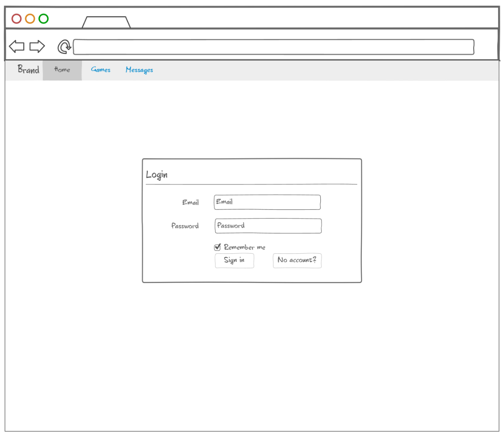
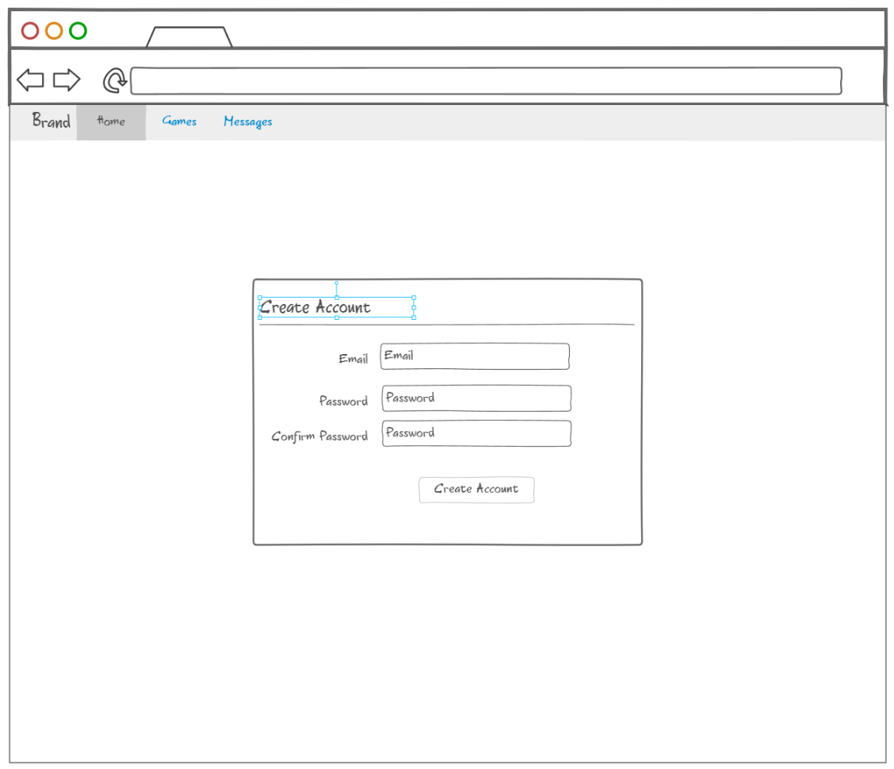
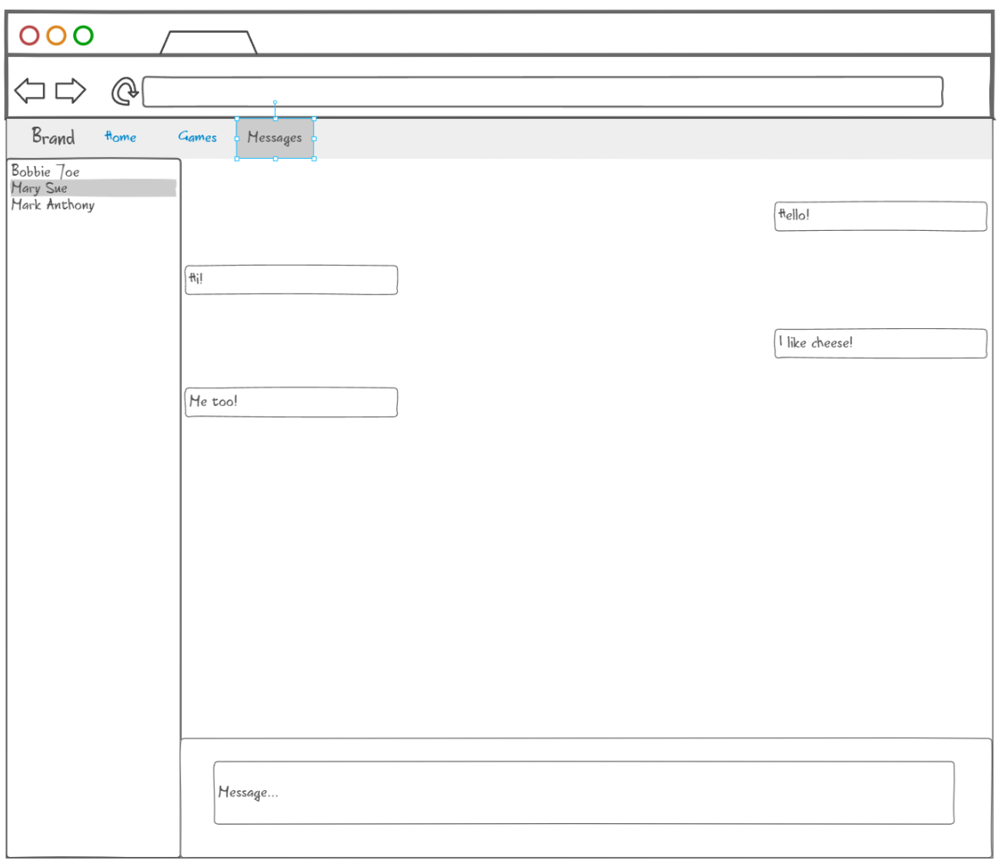
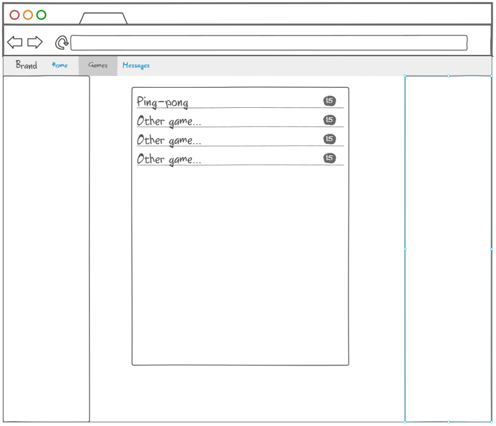

# startup

CS260 Startup Project

## Startup Specification

Elevator pitch: A website where you can play some small games and chat with other users.

#### Preview:

Login page: Where users can login to their accounts

Create Account page: Where users can create an account if they don't already have one

Messaging page: Where users can message other users

Games page: Where users can see all the games offered

Technologies used:

- HTML
  - Used for structure of pages
- CSS
  - Used for styling pages
- Javascript
  - Used for setting up interatibility of pages
- Web service
  - Calls database to get messages
- Authentification
  - Used for accounts
- Database
  - Used for keeping messages
- WebSocket
  - Used for messaging service
- Web framework
  - React for components

### Startup HTML

HTML pages:

- 5 pages to login, create accounts, message other users, and play games

Links:

- All pages link to each other, as well as both the login and create account pages linking to each other as appropriate

Text:

- Games page has a placeholder for where the games will go
- Message page has a placeholder for a list of other users to message and messages received

Images:

- Games have images next to them for their icon

Placeholder for 3rd party calls:

- Create Account has an email input for their account, and it will call a 3rd party to check their email

DB/Login:

- Login and create account page, as well as messages saved in the DB

Websocket:

- Messages received and sent in real time

### Startup CSS

Header, Footer, and Main content body

- Stylized!

Navigation Elements

- Changed most anchor tags to be enclosed in buttons, which now have style as well.
- Anchor tags lost their blue color and underlines.

Responsive to window resizing

- The header and footer will disappear if the page goes under 360px

Application elements

- Tried a darktheme, and it looks alright. I'm not a good guy with colors, but it works for now.

Application text content

- I have standarized colors for both fonts and backgrounds.

Application images

- I have some images, and all I did was put them where they needed to be.

### Javascript deliverable

Login

- Login and create account pages are implemented, and if the user is logged in then the initial page will display your username

Database

- Displayed messages. The messages need to be saved on the database for true data persistence. That has been mocked using localStorage

WebSocket

- Sending and recieving messages will be handled with websocket. However, that has been mocked with localStorage, and whenever you send a message it will just echo it back to you.

Application logic

- If a user isn't logged in, then it will display some things such as not letting them send messages because they need to be logged in.

### Service deliverable

 - Node.js/Express HTTP service: Done!
 - Static middleware for frontend: Done!
 - Calls to 3rd party: Done! When user types: "joke" and sends it to another user in messages, it will send a random joke.
 - Backend service endpoints: Auth and messaging done
 - Frontend calls service endpoints: Calls to auth and messages, and 3rd party joke service.

Also, decided to change and focus exclusively on the messaging service. Games would be too hard right now, and for now the games tab can serve like a curated list of games to play. Messaging is plenty hard and still hits all requirements.

### Login deliverable

 - MongoDB Atlas database created - done!
 - Stores data in MongoDB - done!
 - User registration - user info and auth tokens stored in the database!
 - Messages and convos stored on the database!
 - Restricts functionality - Users can only create convos and messages if they are involved in a convo. Restricted on the back end
